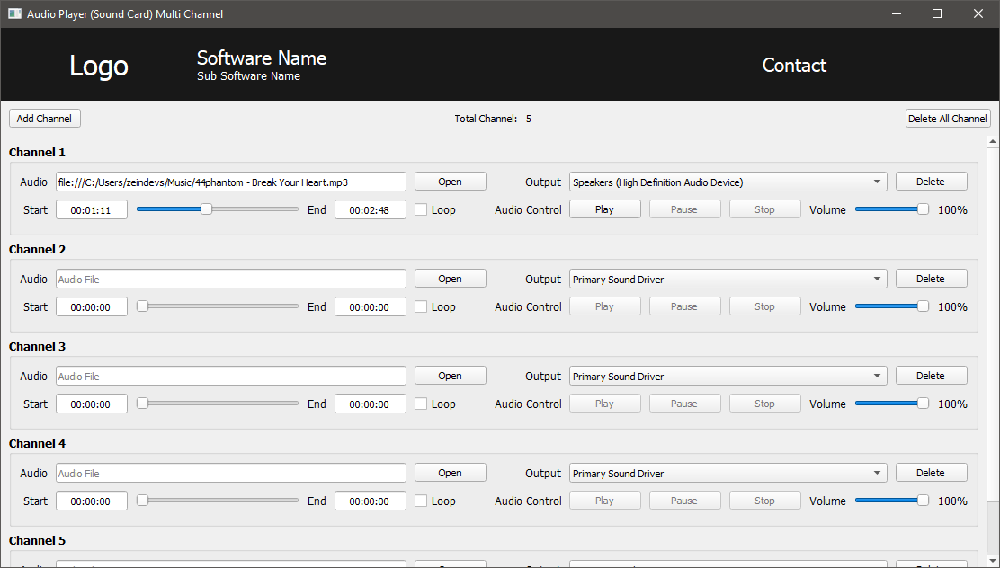

# Qt5 Audio Player (Soundcard) Multi Channel

## Dependencies

- PyQt5

- PyAudio

- 

## Todos

- [x] Create UI interface (.ui)

- [x] Setup UI

- [ ] Configure Media Player Control

- [ ] Thread processing

- [ ] Soundcard output

## License
